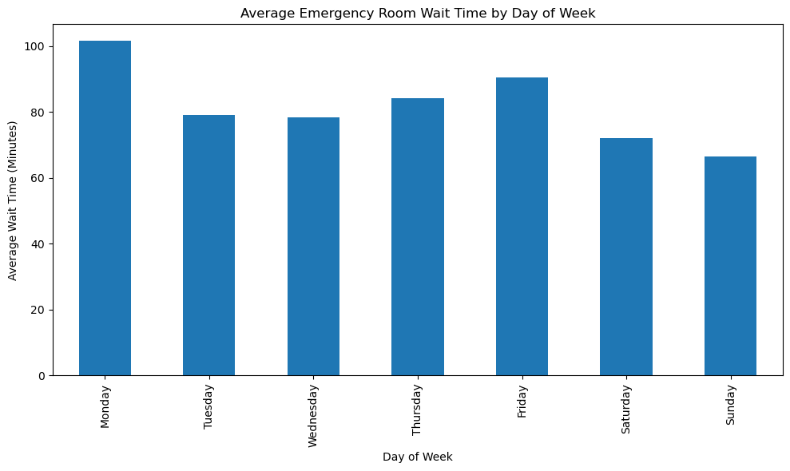
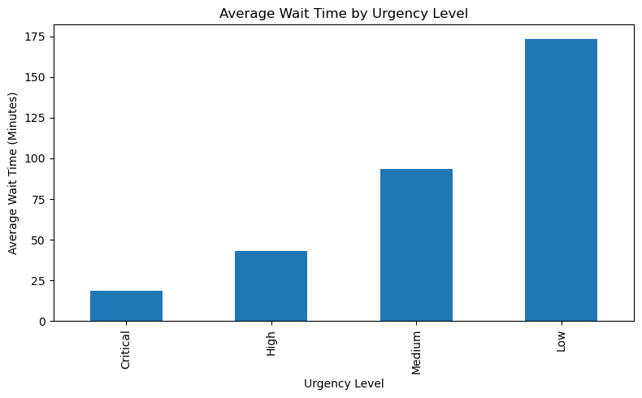
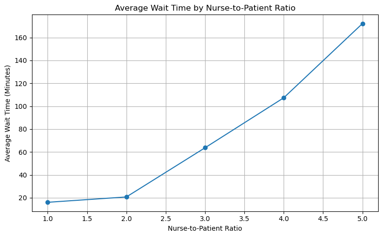
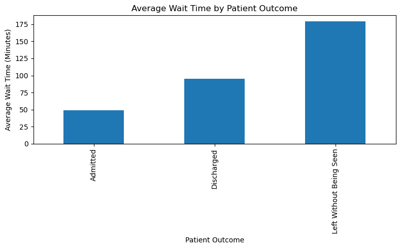
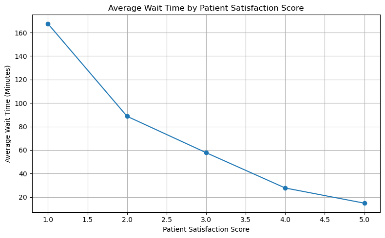
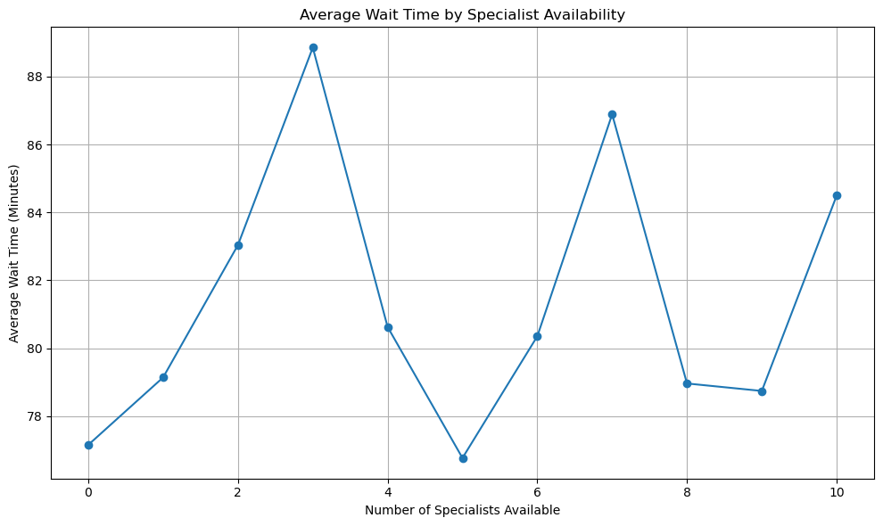
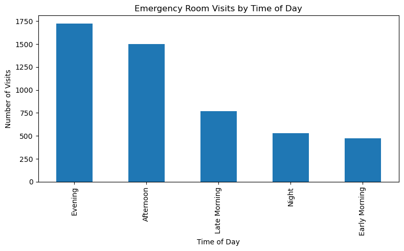
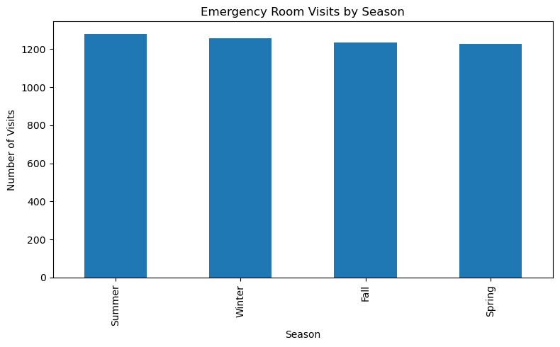
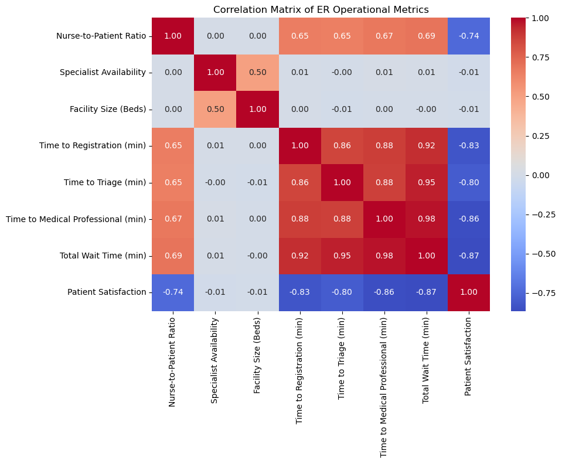

# Emergency Room Wait Time Analysis

## Project Overview

This healthcare analytics project analyzes 5,000 emergency room patient visits to identify operational factors affecting wait times, patient satisfaction, and patient outcomes.

The analysis focuses on staffing levels, patient flow, demand patterns, and operational bottlenecks to provide actionable recommendations for improving emergency department performance.

## Business Problem

Emergency departments must balance patient demand, staffing resources, and quality of care while minimizing patient wait times. Long delays can negatively impact patient satisfaction and increase the likelihood of patients leaving without being seen.

This project investigates the factors that contribute most to emergency room wait times and patient outcomes.

## Tools Used

- Python
- Pandas
- NumPy
- Matplotlib
- Seaborn
- Jupyter Notebook

## Key Findings

- Mondays experienced the highest average wait times.
- Critical patients received significantly faster care than low-priority patients.
- Higher nurse-to-patient ratios were associated with substantially longer wait times.
- Patient satisfaction decreased as wait times increased.
- Patients who left without being seen experienced the longest delays.
- Afternoon and evening periods represented the highest demand periods.

## Business Impact

The analysis suggests that staffing levels and operational bottlenecks throughout the patient journey significantly influence emergency department performance.

Potential benefits of addressing these issues include:

- Improved patient satisfaction
- Reduced patient abandonment rates
- Better resource allocation
- Increased operational efficiency
- Improved patient outcomes

## Sample Visualizations

### Average ER Wait Time by Day of Week

### Average Wait Time by Urgency Level

### Average Wait Time by Nurse-to-Patient Ratio

### Average Wait Time by Patient Outcome

### Average Wait Time by Patient Satisfaction Score

### Average Wait Time by Specialist Availability

### Emergency Room Visits by Time of Day

### Emergency Room Visits by Season

### Correlation Matrix of ER Operational Metrics

## Project Files

- Emergency Room Wait Time Analysis.ipynb
- er_wait_time_dataset.csv
- images/
- README.md

